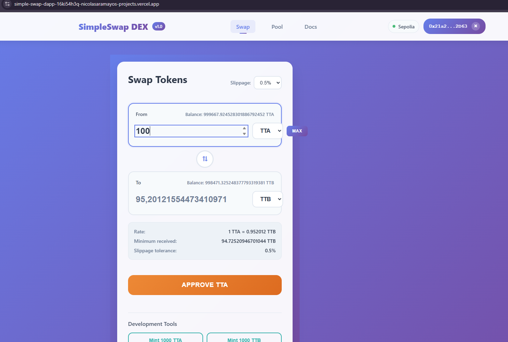

# SimpleSwap DApp

A simple decentralized exchange (DEX) built with Solidity smart contracts and React frontend.

## Live Demo

**🚀 Deployed on Vercel:** [https://simple-swap-dapp-16ki54h3q-nicolasaramayos-projects.vercel.app/](https://simple-swap-dapp-16ki54h3q-nicolasaramayos-projects.vercel.app/)

## Frontend Preview



## Project Structure

```
simpleSwapDapp/
├── contracts/          # Smart contracts (Solidity)
│   ├── SimpleSwap.sol  # Main DEX contract
│   └── SimpleToken.sol # Simple token for testing
├── test/              # Solidity tests
│   └── SimpleSwap.test.js
├── scripts/           # Deployment scripts
│   ├── deploy.js
│   └── initialize-sepolia.js
├── frontend/          # React frontend
│   ├── src/
│   ├── public/
│   └── package.json
├── hardhat.config.js  # Hardhat configuration
├── .env.example       # Environment variables template
└── package.json       # Project dependencies
```

## 🚀 Quick Start

### Prerequisites
- Node.js (v16 or higher)
- npm or yarn

### Installation

1. **Clone the repository**
```bash
git clone https://github.com/nicolasaramayo/simpleSwapDapp.git
cd simpleSwapDapp
```

2. **Install dependencies**
```bash
# Install all dependencies (consolidated)
npm install
```

3. **Set up environment variables**
```bash
# Copy the example environment file
cp .env.example .env

# Edit .env with your API keys and private key
# NEVER commit your .env file to version control!
```

### Environment Variables Required:
- `ALCHEMY_API_KEY`: Your Alchemy API key for Sepolia testnet
- `SEPOLIA_PRIVATE_KEY`: Your wallet private key (keep this secret!)
- `ETHERSCAN_API_KEY`: Your Etherscan API key for contract verification


## Testing

### Run Solidity Tests
```bash
npm test
# or
npx hardhat test
```

### Run Test Coverage
```bash
npm run coverage
# or
npx hardhat coverage
```

**Current Coverage:**
- **SimpleSwap.sol**: 92.55% statements, 90% lines
- **SimpleToken.sol**: AVISO: ESTE ES UN MOCK Y solo para uso del SimpleSwap.sol pase los test coverage.

### Run Frontend Tests
```bash
npm run frontend:test
```

## 🔧 Smart Contracts

### Compile Contracts
```bash
npm run compile
# or
npx hardhat compile
```

### Deploy to Local Network
```bash
npm run deploy:localhost
# or
npx hardhat run scripts/deploy.js --network localhost
```


##  Frontend

### Start Development Server
```bash
npm run frontend:start
# or
cd frontend
npm start
```

## Contract Features

### SimpleSwap Contract

- **Token Swapping**: Swap tokens using AMM formula
- **Price Calculation**: Get token prices and amounts

##  Deployed Contracts

### Sepolia Testnet
- SimpleSwap: [Contract Address]
- SimpleToken A: [Contract Address]
- SimpleToken B: [Contract Address]

## Security Notes

- **NEVER commit your `.env` file** - it contains sensitive information
- **Keep your private keys secure** - never share them
- **Use testnet for development** - don't use mainnet for testing

## License

MIT License

## Author

Nicolas Fabian Aramayo
